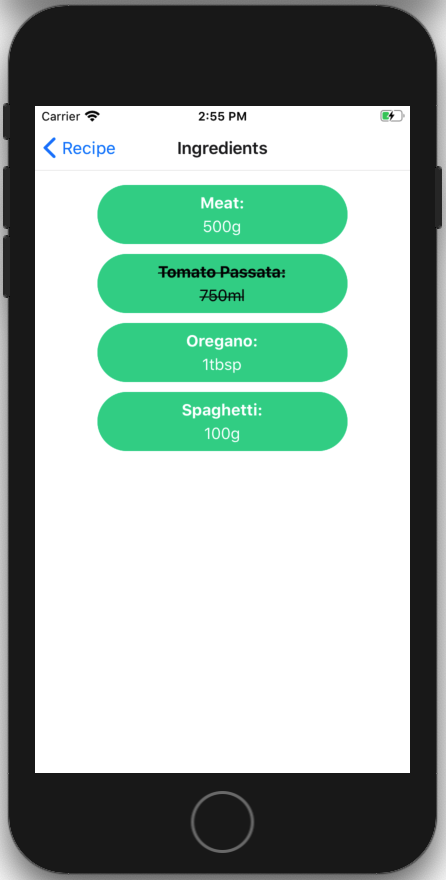
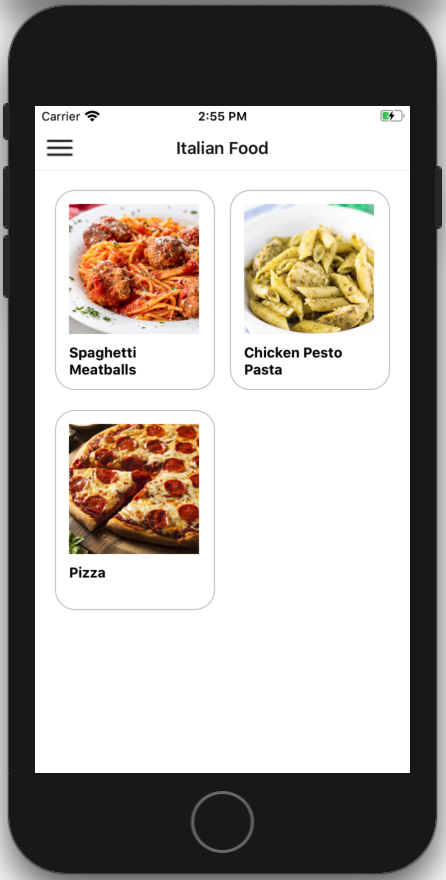

# Recipe-app

React Native app to display your recipes in a structured manner.

## Scripts

This app  is set up with Expo cli.
To start it up. Clone the repo, cd into the folder and run
```
npm install && expo start
```

## Usage

The Home Screen displays all recipes in the database.

When you press on a recipe you get a Recipe Screen with name, cook time and cooking description.

You can press on view ingredients to get a list of all ingredients that you can cross off as you use them.

From the home screen, you can use the button in the top left corner to get a menu.

In the Categories Screen, you are able to choose a specific food category to be displayed in the same format as the home screen.

## Preview






